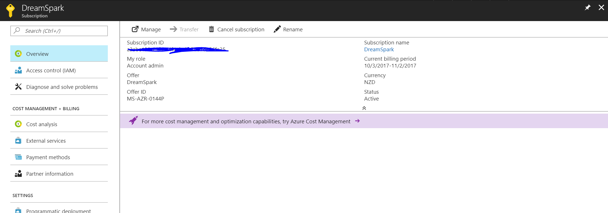

# Your Device

You must bring your own device to Advanced Training, and you will be using this for most of training and assessment in a hands on manner. 

* Reasonably recent and powerful Laptop
* Must run Windows (Preferred) or Mac OS (Apple)
* BATTERY LIFE: Must be sufficient to last at-least 4 hours without power

# What to Bring

* Laptop & Other Devices
* Laptop Charger
* MicroUSB Cable
* Android or iOS Device
* Snacks, Lunch, Drink Bottle, etc

# Note on Recordings

Due to the pace of training and the hands on nature of it, lecture recordings will not be made available. We honestly do want to give you as much resource and help as possible, but in this instance, it is simply not practicale for us to process and upload 8 hours of high definition video content every day during training.

# Software Needed (IMPORTANT)

Please install the software *before* you attend advanced training. We will not spend time going over installation. If you do not have the below software installed, you will be left behind. 

If you do not have this software installed, MSPs have clear instructions to NOT help you install it on the day.

* [Visual Studio Code](https://code.visualstudio.com/download)
* Optional for Windows: [Visual Studio 2017] (https://www.visualstudio.com/downloads/)
* [NodeJS](https://nodejs.org/en/download/)
* [NPM (Node Package Manager)](https://www.npmjs.com/get-npm)
* [Microsoft Bot Builder SDK](https://docs.microsoft.com/en-us/bot-framework/resources-tools-downloads) 
* [Microsoft Bot Emulator](https://github.com/Microsoft/BotFramework-Emulator/releases/tag/v3.5.31)

# Accounts Needed (IMPORTANT)

Please ensure you are registered and have ACCESS to the following services. Again, we will not spend time teaching you how to do this. if you do not have the access ready to go below, you will be left behind. MSPs have clear instructions to NOT help you get them on the day.

* Microsoft Azure (Imagine Subscription)
* LUIS
* Custom Vision Service
* Microsoft Bot Framework

## Microsoft Azure Imagine Subscription

All students should have this from Basic Training, to check, visit the [Microsoft Azure Portal](http://portal.azure.com) and check the Subscriptions tab to ensure you have either a "Dreamspark" or "Imagine" subscription listed, like below:

If you don't, then visit [Microsoft Imagine](http://imagine.microsoft.com) to register yourself as a student, verify and activate Azure through the links on the site - but you really should have it from Basic Training!

Next up, you need to create a Bot Service in Azure, which you can do here [https://ms.portal.azure.com/#create/Microsoft.BotApp](https://ms.portal.azure.com/#create/Microsoft.BotApp). We reccomend you select a new resource group as well.

## LUIS

We'll explain LUIS at Advanced Training, but for now, visit [luis.ai](http://luis.ai) and sign in, making sure everything works.

## Custom Vision Service

We'll explain Custom Vision at Advanced Training, but for now, visit [customvision.ai](http://customvision.ai) and sign in, making sure everything works.

## Microsoft Bot Framework

Now this is the important one. We will be building a bot and its important we have a Bot Developer Account. visit [Micosoft Bot Framework - Dev Site](https://dev.botframework.com) and sign in. 

