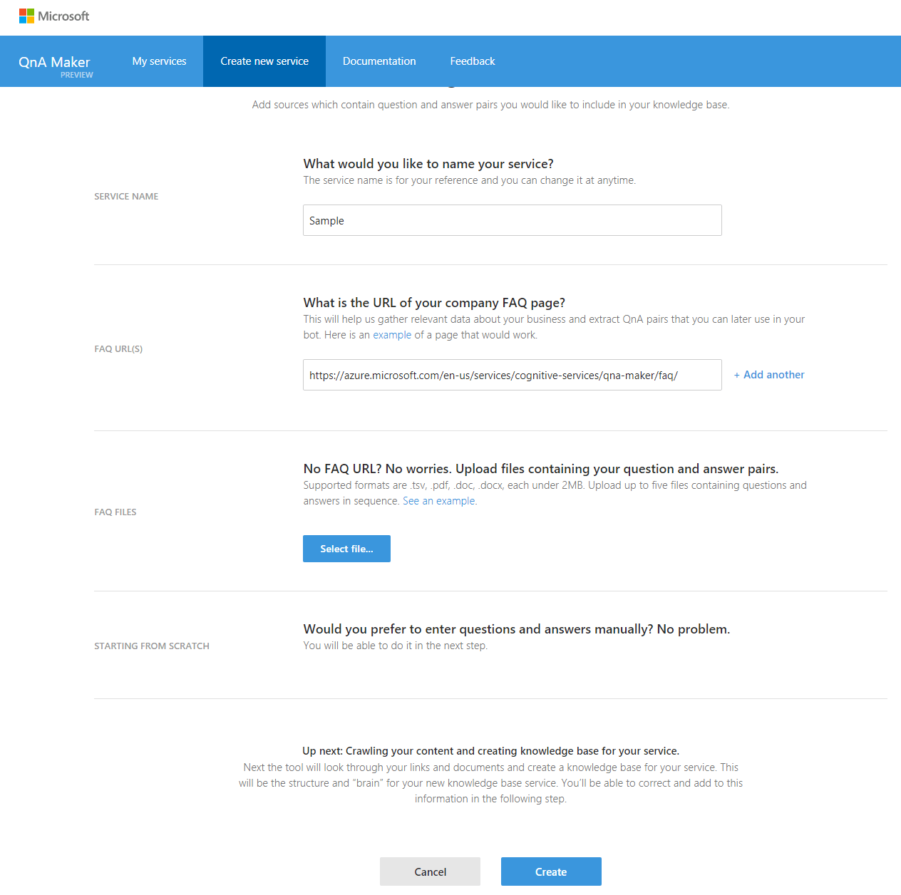
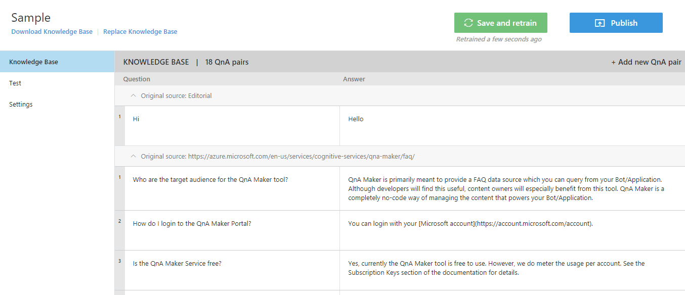
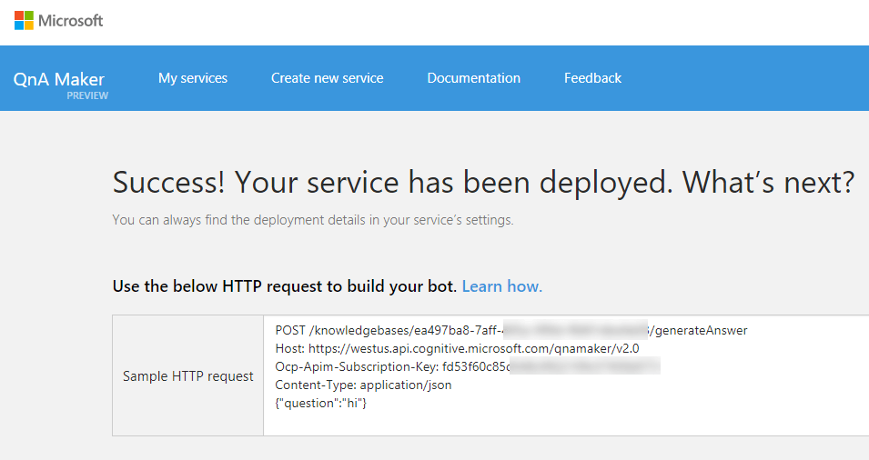

# Q&A Maker
## 1. Introduction
For this session we'll be looking at how to integrate Q&A Maker into your bot.  

But what is Q&A Maker?

Q&A Maker is a tool made by Microsoft to help you leverage FAQs knowledge base without needing to write complex code. Simply upload your FAQs as a TSV (tab-separated values) or give Q&A Maker a URL pointing to your FAQ, and let Q&A Maker do the rest. Q&A Maker also gives you the power to test your knowledge base with various utterances, allowing you to fine-tune your knowledge base.

## 2. Setting up Q&A Maker
* Navigate to https://qnamaker.ai/
* Click the ```Create new service``` button
* Accept the terms of use
* Give a name to your bot and the url of your FAQ. For now, use https://azure.microsoft.com/en-us/services/cognitive-services/qna-maker/faq/

You should have something like this:



* Review the list of questions and awsers. You can also test and train your bot in the ```Test``` tab.



* Click the ```Publish``` button

Your bot is up! You can now integrate it in your application.

## 3. Using the HTTP API

After publishing the bot, you see the sample request to get the answers to a question:



Fist thing's first, we need to create a function which will be used to talk with Q&A Maker.

* Inside ```Restclient.js``` copy the following:
```javascript
exports.postQnAResults = function getData(url, session, question, callback){
  var options = {
      url: url,
      method: 'POST',
      headers: {
          'Ocp-Apim-Subscription-Key': '[REFER TO IMAGE ABOVE]',
          'Content-Type':'application/json'
      },
      json: {
          "question" : question
      }
    };

    request(options, function (error, response, body) {
      if (!error && response.statusCode === 200) {
          callback(body, session, question);
      }
      else{
          console.log(error);
      }
    });
};
```

What we want to do now is add a new controller for Q&A Maker. 

* Inside the controller folder, create a new file called ```QnAMaker.js```
* Inside ```QnAMaker.js``` copy the following:
```javascript
var rest = require('../API/Restclient');

exports.talkToQnA = function postQnAResults(session, question){
    var url = 'https://westus.api.cognitive.microsoft.com/qnamaker/v2.0/knowledgebases/[REFER TO IMAGE ABOVE]/generateAnswer';
    rest.postQnAResults(url, session, question, handleQnA)
};

function handleQnA(body, session, question) {
    session.send(body.answers[0].answer);
};
```
This function ```talkToQnA``` will call the ```postQnAResults``` function we just created. The ```handleQnA``` callback function will be used to handle our response from Q&A Maker.

Now we need a way to trigger Q&A Maker. For time sake, lets just create a new intent inside Luis called ```QnA``` and train it with utterances from Q&A Maker.

* Once you've created a new intent in Luis, now lets add a handler for that intent in our bot. Copy the following into ```LuisDialog.js```:
```javascript
bot.dialog('QnA', [
    function (session, args, next) {
        session.dialogData.args = args || {};
        builder.Prompts.text(session, "What is your question?");
    },
    function (session, results, next) {
        qna.talkToQnA(session, results.response);
    }
]).triggerAction({
    matches: 'QnA'
});
```

Now lets try it out!